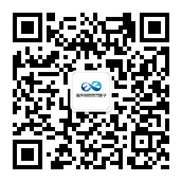

这里主要分享一些程序员需要的学习资源，全部收集于网络，如果有侵权，请联系删除！

如果觉得不错，麻烦给个star，谢谢！

## 1 原创学习资源

**面试算法资料，这是总结的算法资料，学完基本可以应付80%大厂**

**大厂面试资料，一年时间总结，覆盖Java所有技术点**

**面试思维导图，手打总结**

## 2 视频教程类学习资源

👉 如果你不知道该学习什么的话，请看 [Java 学习线路图是怎样的？](https://zhuanlan.zhihu.com/p/392712685) （原创不易，欢迎点赞），这是 2021 最新最完善的 Java 学习路线！

### Java相关

1、Java基础

2、Java基础提升

3、html教程

4、JavaScript基础教程

5、JavaScript高级教程

6、Jquery基础教程

7、Jquery高级教程

8、Bootstrap教程

9、Java Web相关教程
- Tomcat和Servlet教程
- Response教程
- Filter和Listener教程
- XML教
- EL和JSTL教程
- Cookie和Session教程
- AJAX和Json教程
- Java web 综合项目

10、MySQL数据库教程

11、Redis教程

12、Maven教程

13、Linux和nginx教程

14、Spring教程

15、SpringMVC教程

16、Mybatis

17、git

18、ssm项目实战一

19、Dubbo

20、Springboot教程

21、消息中间件教程

22、Springcloud教程

23、ElasticSearch教程

24、Docker教程

25、面试相关

26、ssm综合实战项目

### Java实战项目
spring + stucts + hibernate 项目实战

spring + mybatis + springmvc 项目实战

springboot + springcloud + dubbo等微服务实战项目

spring + springmvc + mybatis 物流管理系统

springboot + springcloud + dubbo + ElasticSearch等商城项目

springboot + springcloud + dubbo社区 + 社交项目

微服务 物流 + 商城项目

`上面资源因为某些原因，暂不支持公开分享了，如果大家有需要，可以联系我，我将把我的个人原创的学习资料分享出来。`

**划重点**：获取上面的资源，请关注我的公众号 `程序员的技术圈子`，**微信扫描下面二维码**，回复：`Java资料`，添加我的个人微信，我将把个人原创的Java面试和学习资料分享给你，没有套路。

  

持续更新中，请关注...